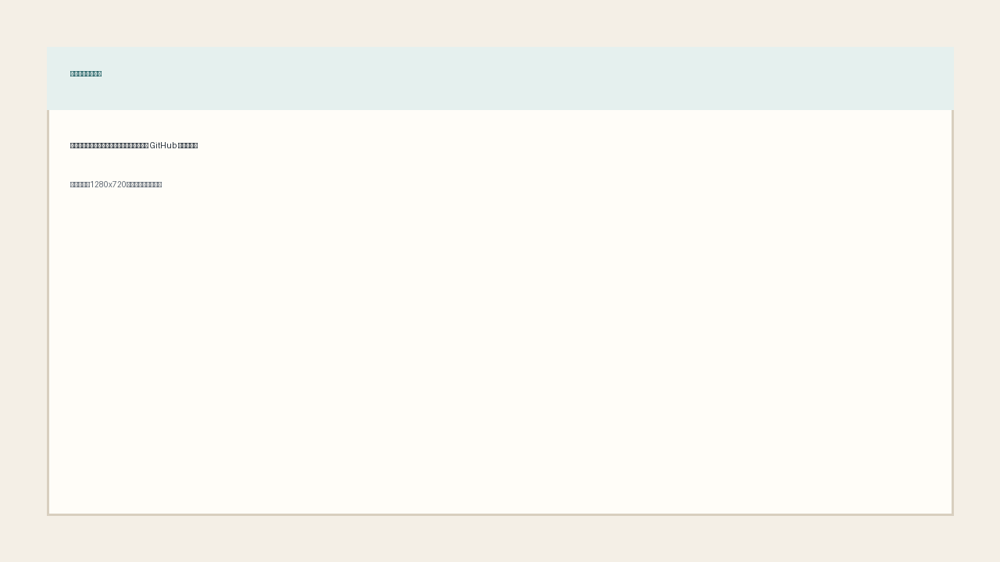
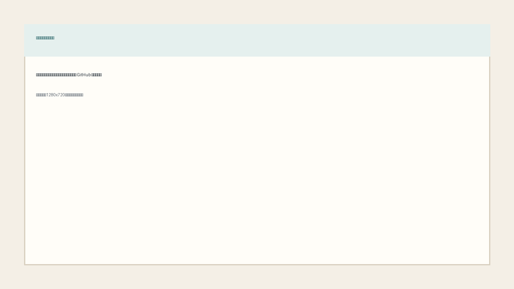
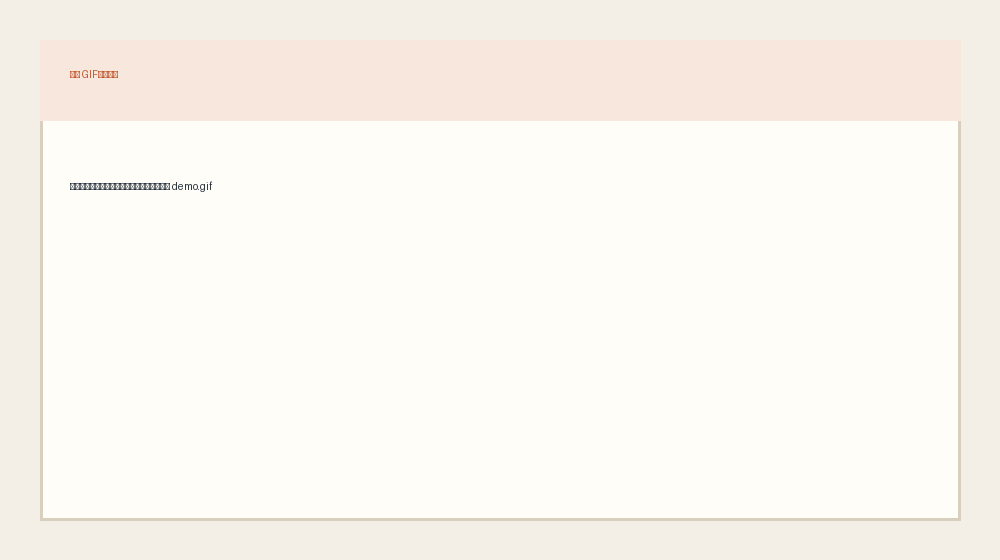

# IELTS 写作批改网站 (MVP)

一个基于 **Next.js 14 + Prisma + NextAuth + RAG + DeepSeek** 的雅思作文批改项目。  
支持从题目选择、作文提交，到自动批改、历史复盘的一整套流程。

## 项目亮点

- 账号系统：邮箱注册/登录（Credentials）
- 作文提交：题库选题 + 自定义输入
- 智能批改：四项评分、总评、句级建议、改写示例、行动建议
- RAG 召回：展示最相关范文与参考观点
- 历史记录：按用户查看提交记录
- 报告重生成：同一 submission 支持多份报告版本

## 页面展示

### 首页



### 提交页


### 结果页



### 演示动图



## 系统流程图


## 技术栈

- 前端：`Next.js 14 (App Router)`、`React 18`、`Tailwind CSS`
- 后端：`Next.js Route Handlers`
- 认证：`next-auth v5`
- 数据库：`PostgreSQL` + `Prisma`
- AI：`openai SDK`（DeepSeek 兼容接口）

## 目录结构

```text
.
├─ app/                      # 页面与 API 路由
├─ components/               # 业务组件
├─ lib/                      # Auth / RAG / 模型调用 / 报告处理
├─ prisma/
│  ├─ schema.prisma
│  └─ seed.ts
├─ data/                     # Seed 数据
│  ├─ questions.json
│  ├─ essays.json
│  └─ knowledge_chunks.json
├─ scripts/
│  ├─ e2e-smoke.mjs
│  └─ parse_knowledge_base.py
├─ docs/
│  ├─ images/
│  └─ submission/
├─ .env.example
└─ README.md
```

## 本地启动

1. 安装依赖

```bash
npm install
```

2. 配置环境变量

```bash
cp .env.example .env.local
```

3. 初始化数据库与种子数据

```bash
npm run prisma:push
npm run db:seed
```

4. 启动开发环境

```bash
npm run dev
```

访问：`http://localhost:3000`

## 常用命令

```bash
npm run dev
npm run build
npm run start
npm run lint
npm run prisma:push
npm run db:seed
npm run e2e:smoke
```

## 一键部署到 Vercel

1. 把项目推送到 GitHub 仓库。
2. 打开 Vercel，点击 `Add New Project`，导入该仓库。
3. 在 `Environment Variables` 中填写以下变量：
   - `DATABASE_URL`
   - `NEXTAUTH_URL`（首次可先填临时域名，部署后改成正式域名）
   - `NEXTAUTH_SECRET`
   - `DEEPSEEK_API_KEY`
4. 点击 `Deploy`。
5. 部署完成后，你会得到公开网址：`https://你的项目名.vercel.app`

详细步骤见：[docs/DEPLOY_VERCEL.md](docs/DEPLOY_VERCEL.md)
